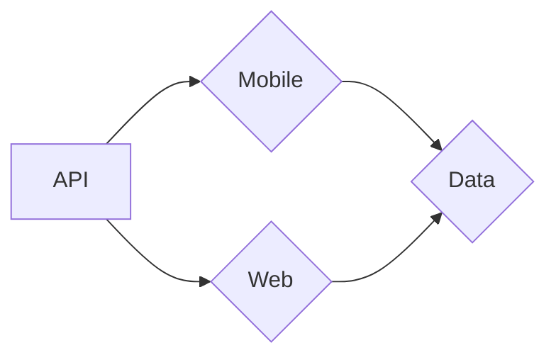

# Stonk's Area!

This is our project **AREA** of third year in Epitech Lille. 
- Server -> Node.js (Express.js)
- Database -> MySQL
- Front Web -> JavaScript (React.j)
- Front Mobile -> Flutter 

## Usage
- Install docker for running the project.

- Run `docker-compose build && docker-compose up`

### Informations
- The server is host on (localhost:8080)
- The application mobile is host on (xxxx)
- The application web is host on (xxxx)

## Services

**In Progress**

## Front

# Back
