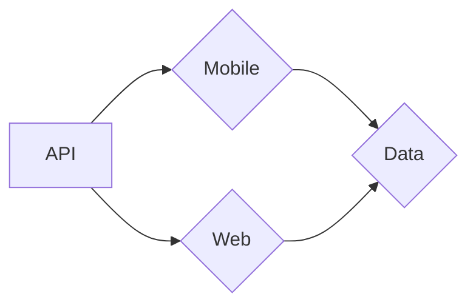

# Stonk's Area!

This is our project **AREA** of third year in Epitech Lille. Developped in React.js, Expres.js , Flutter, MySQL

## Usage
- Install docker for running the project.

- Run `docker-compose build && docker-compose up`

The server is host on (localhost:8080)
The application mobile is host on (xxxx)
The application web is host on (xxxx)

## Services

**In Progress**

## Front

### Mobile App
---
The mobile application was developped with flutter 

### Web App
---
The web application was developped in Express.js
# Back
